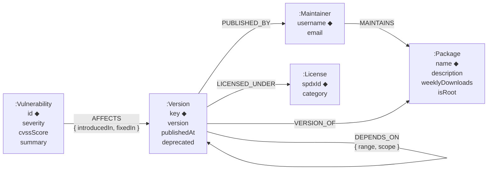
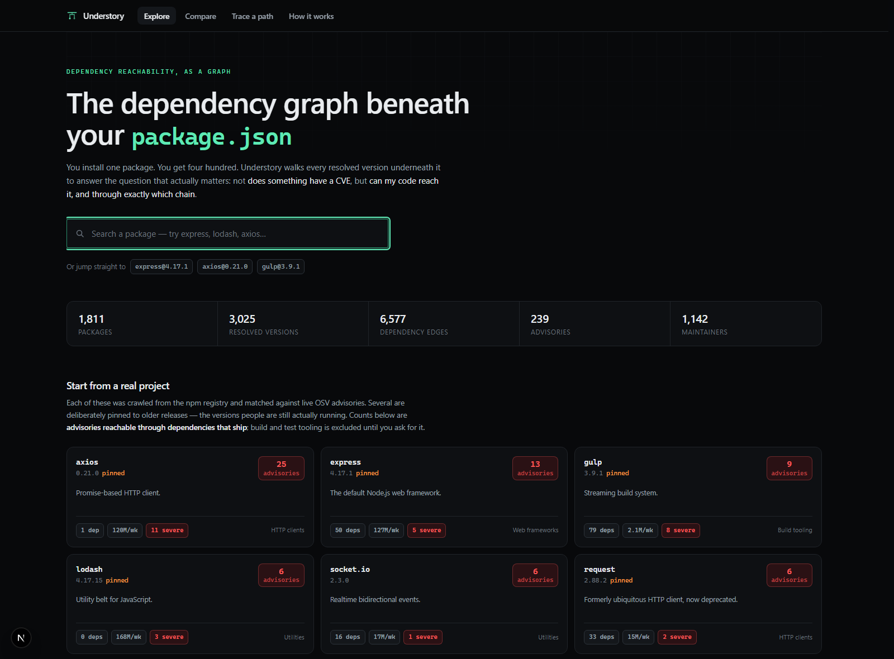
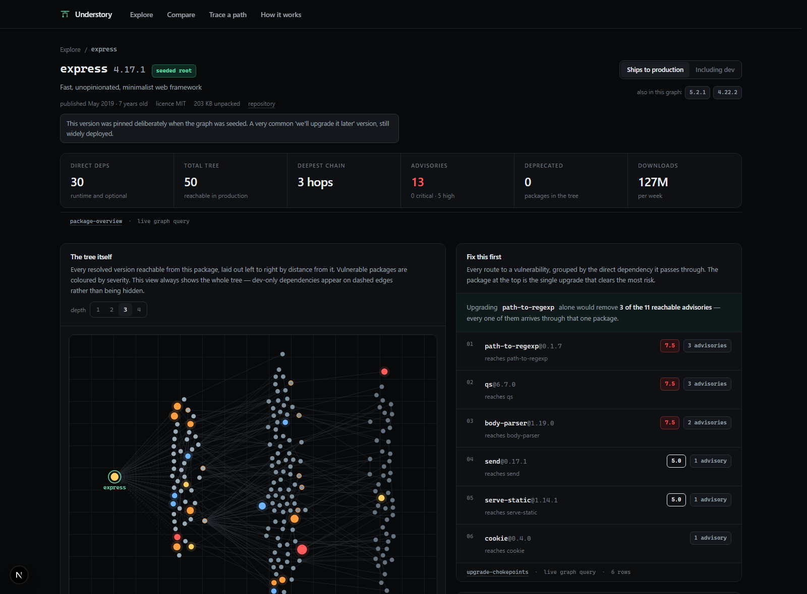
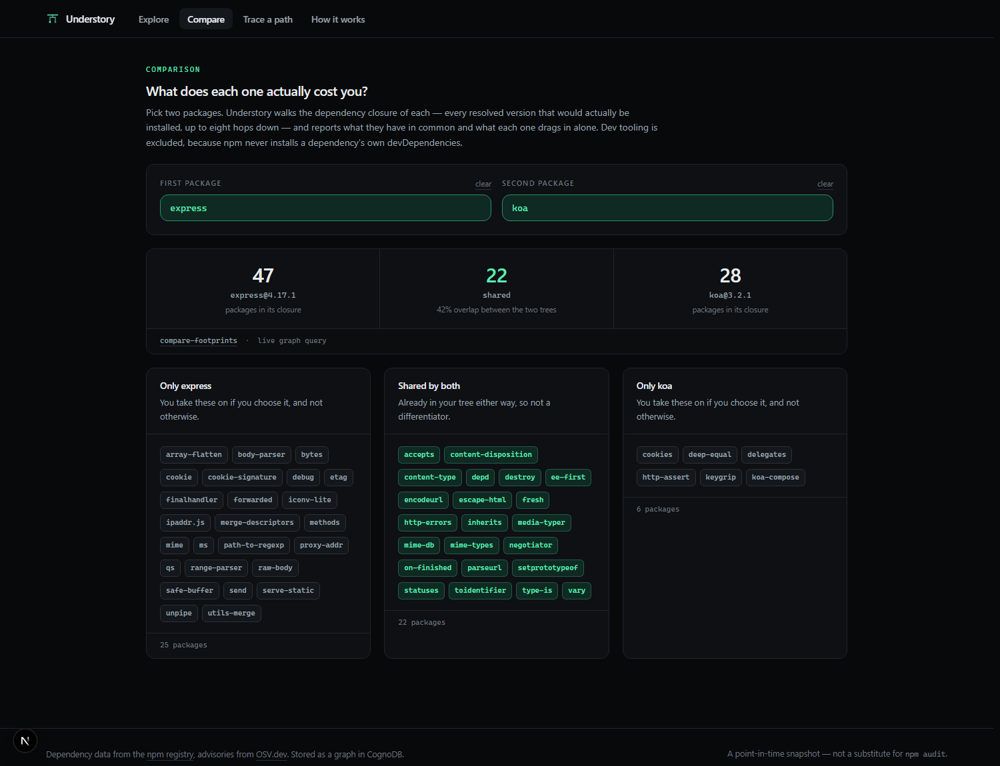
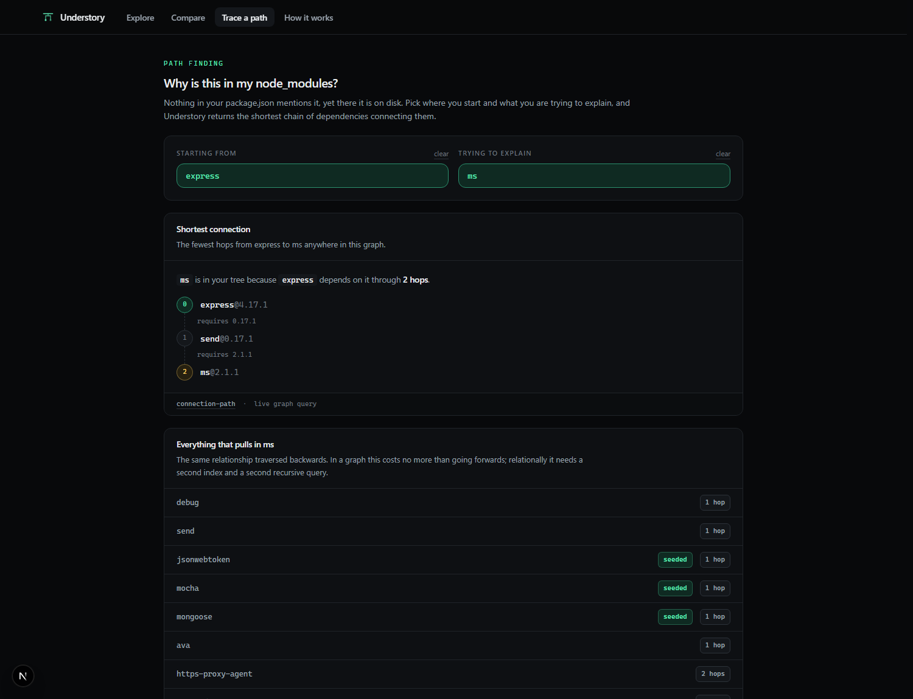
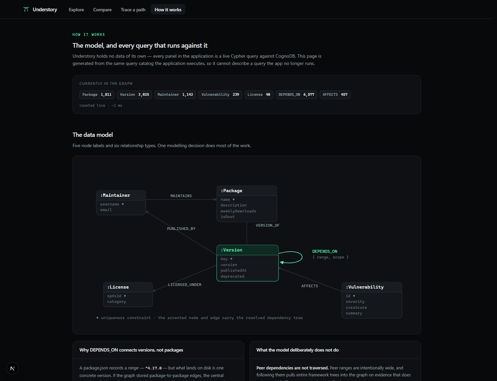

# Understory

**The dependency graph beneath your `package.json`.**

You install one package. You get four hundred. Understory walks every resolved version underneath it to answer the question a dependency audit actually needs answered — not *does something have a CVE*, but **can my code reach it, and through exactly which chain**.

Built on [CognoDB](https://console.cognodb.com), openCypher over Bolt, driven by the official Neo4j JavaScript driver.

| | |
|---|---|
| **Live demo** | _(deployment URL)_ |
| **Screen recording** | _(recording link)_ |
| **Stack** | Next.js 15 (App Router) · TypeScript · Tailwind CSS 4 · neo4j-driver 5 · CognoDB |
| **Data** | npm registry (dependency graph) + [OSV.dev](https://osv.dev) (advisories) |
| **Graph size** | ~1,800 packages · ~3,000 resolved versions · ~21,000 relationships |

---

## Contents

1. [The problem](#the-problem)
2. [Why a graph database?](#why-a-graph-database)
3. [The data model](#the-data-model)
4. [The queries that matter](#the-queries-that-matter)
5. [Screenshots](#screenshots)
6. [Running it yourself](#running-it-yourself)
7. [Architecture](#architecture)
8. [Correctness decisions](#correctness-decisions)
9. [Limitations](#limitations)
10. [Command reference](#command-reference)

---

## The problem

A modern npm project has a handful of direct dependencies and several hundred transitive ones. When an advisory lands against a package buried four levels down, three questions follow immediately:

1. **Can my application actually reach it?** — an advisory in a package that only your test runner installs is not the same problem as one in your HTTP router.
2. **Through what chain?** — you cannot fix `handlebars` if nothing in your `package.json` mentions it. You need the intermediate package that pulled it in.
3. **If I can only fix one thing, which?** — with eleven reachable advisories and an afternoon, which single upgrade removes the most risk?

`npm audit` answers the first question partially and the other two not at all. All three are questions about **paths through a graph**, which is what this application is built to answer.

Understory also covers two adjacent supply-chain questions that are the same shape:

- **Maintainer blast radius** — if one npm account were compromised, how much of what you install could they publish to? (`dougwilson` can publish to 48 packages in express's tree.)
- **Licence exposure** — a copyleft licence you chose is a decision; the same licence arriving at depth five through three packages you have never heard of is a discovery.

---

## Why a graph database?

> **The short version:** every interesting question here is about a path of *unknown length*, and the answer needs to be the path itself.

Consider the flagship query — *which advisories can `express@4.17.1` reach, and how?*

**In Cypher**, with the resolved dependency tree stored as `(:Version)-[:DEPENDS_ON]->(:Version)`:

```cypher
MATCH (root:Version { key: $rootKey })
MATCH (vuln:Vulnerability)-[affects:AFFECTS]->(target:Version)
MATCH path = shortestPath((root)-[:DEPENDS_ON*0..8]->(target))
RETURN vuln.id, length(path) AS depth,
       [node IN nodes(path) | node.key] AS chain
```

Four lines. The variable-length pattern `*0..8` handles the unknown depth, `shortestPath` runs a bidirectional breadth-first search because both endpoints are bound, and `nodes(path)` hands back the route as a first-class value.

**The same thing in SQL** needs a recursive CTE that:

- re-joins the dependency table once per level of depth;
- carries an array of already-visited ids to break cycles — npm dependency graphs genuinely contain them, and without the guard the query does not terminate;
- string-aggregates ids on the way down so the route can be reconstructed afterwards, because a relational result set has no notion of a path;
- and then still cannot be planned well, because the size of the closure is unknown until it has been computed.

```sql
WITH RECURSIVE reachable(from_id, to_id, depth, visited, chain) AS (
    SELECT v.id, d.to_version_id, 1,
           ARRAY[v.id, d.to_version_id], v.key || ' -> ' || t.key
      FROM versions v
      JOIN depends_on d ON d.from_version_id = v.id
      JOIN versions   t ON t.id = d.to_version_id
     WHERE v.key = $1
    UNION ALL
    SELECT r.from_id, d.to_version_id, r.depth + 1,
           r.visited || d.to_version_id, r.chain || ' -> ' || t.key
      FROM reachable r
      JOIN depends_on d ON d.from_version_id = r.to_id
      JOIN versions   t ON t.id = d.to_version_id
     WHERE r.depth < 8
       AND NOT d.to_version_id = ANY(r.visited)   -- manual cycle break
)
SELECT DISTINCT ON (a.vulnerability_id) ...        -- and now find the *shortest* one
  FROM reachable r JOIN affects a ON a.version_id = r.to_id
 ORDER BY a.vulnerability_id, r.depth;
```

That is the *simple* one. Three more queries in this application get worse:

| Question | Cypher | Relational equivalent |
|---|---|---|
| **Which single dependency should I upgrade first?** | Take `nodes(path)[1]` of every vulnerability path and group by it | The grouping key does not exist as a column. It only exists once every path has been computed — so the whole closure must be materialised before any aggregation can begin. |
| **Whose npm account could compromise most of my tree?** | One pattern that walks `DEPENDS_ON` an unknown number of hops, then pivots sideways through `VERSION_OF` and `MAINTAINS` | The join key changes halfway through the traversal: a recursive CTE feeding a second join against a many-to-many table, materialising the closure before it can group. |
| **What do these two packages share?** | Two variable-length patterns, then three list comprehensions | Two independent recursive CTEs, each with its own cycle guard, then a full outer join between two result sets of unknown size. |
| **Why is this package in my `node_modules`?** | `shortestPath(...)` | A breadth-first search hand-written as a recursive CTE, plus manual route reconstruction. |

There is also a **modelling** advantage, not just a query one. Because the graph stores *resolved versions* as first-class nodes (see below), "this package is installed at three different versions at once" is a grouping over a traversal result. A schema that stored declared ranges could not answer it at all without re-running semver resolution at query time.

**Where a graph does not help, this project says so.** Of the 16 queries in the catalog, 12 make a specific claim about being better as a traversal. The other four — package search, version lookup, label counts — are ordinary indexed reads, and the `/queries` page labels them as such. Claiming a graph advantage for a `WHERE name CONTAINS $term` would be dishonest.

---

## The data model

Five node labels, six relationship types.



`◆` marks a uniqueness constraint. The same diagram is rendered as inline SVG inside the app at [`/queries`](src/components/model-diagram.tsx).

### The one decision that matters

**`DEPENDS_ON` connects `:Version` → `:Version`, not `:Package` → `:Package`.**

A `package.json` records a *range* (`^4.17.0`), but what lands on disk is one concrete version. If the graph stored package-to-package edges, the central question of this application would be unanswerable: advisories apply to **version ranges**, so whether a path reaches something vulnerable depends entirely on which version each edge resolved to.

So [`scripts/seed/resolve.ts`](scripts/seed/resolve.ts) resolves every declared range with the same rule npm uses — `semver.maxSatisfying`, the highest published version inside the range — and writes an edge between two concrete `:Version` nodes, keeping the declared range as an edge property. That is what makes the reachability results truthful rather than approximate.

### Dependency scope

`DEPENDS_ON` carries a `scope` property mirroring how npm actually installs:

| scope | traversed | reasoning |
|---|---|---|
| `prod` | always | `dependencies` install transitively, forever. This is what ships. |
| `optional` | always | `optionalDependencies` install transitively and usually succeed. |
| `dev` | **from a root only** | npm installs a package's `devDependencies` only when that package *is* the project. A transitive dependency's dev deps never reach your disk. |
| `peer` | recorded, not walked | Peer ranges are deliberately wide (`>=16`); following them pulls whole framework trees in on evidence that does not support it. |

---

## The queries that matter

Every Cypher statement lives in [`src/lib/queries/`](src/lib/queries/) as a `QueryDefinition` carrying its own explanation. The `/queries` page renders that same array, so **the documentation cannot describe a query the application no longer runs**.

### 1. Vulnerability reachability — [`vulnerability-paths`](src/lib/queries/risk.ts)

The flagship. For a given version, every advisory reachable within eight hops, with the exact chain.

```cypher
MATCH (root:Version { key: $rootKey })
MATCH (vuln:Vulnerability)-[affects:AFFECTS]->(target:Version)
WHERE vuln.severity IN $severities
MATCH path = shortestPath((root)-[:DEPENDS_ON*0..8]->(target))
WHERE ALL(hop IN relationships(path) WHERE hop.scope <> 'dev')
RETURN vuln.id, vuln.severity, vuln.cvssScore, affects.fixedIn,
       length(path) AS depth,
       [node IN nodes(path) | node.key]          AS pathKeys,
       [rel  IN relationships(path) | rel.scope] AS pathScopes
ORDER BY CASE vuln.severity WHEN 'CRITICAL' THEN 0 WHEN 'HIGH' THEN 1 ... END,
         coalesce(vuln.cvssScore, 0) DESC, depth
```

Driving from the advisory side rather than the root is deliberate: only about 10% of versions carry an advisory, so it is a far smaller starting set than "everything reachable from the root". With both endpoints bound, `shortestPath` runs as a bidirectional BFS.

**Real result** — `express@4.17.1`, all scopes:

```
CRITICAL 9.8  GHSA-765h-qjxv-5f44   depth 2
   express@4.17.1  →  hbs@4.0.4  →  handlebars@4.0.14
   fixed in 4.7.7 · Prototype Pollution in handlebars
```

### 2. Upgrade chokepoints — [`upgrade-chokepoints`](src/lib/queries/risk.ts)

The actionable one. Take the **first hop** of every vulnerability path and group by it: *how much risk flows through this one direct dependency?*

```cypher
MATCH (root:Version { key: $rootKey })
MATCH (vuln:Vulnerability)-[:AFFECTS]->(target:Version)
WHERE target <> root
MATCH path = shortestPath((root)-[:DEPENDS_ON*1..8]->(target))
WITH vuln, target, nodes(path)[1] AS direct, length(path) AS depth
RETURN direct.packageName, count(DISTINCT vuln.id) AS vulnerabilityCount,
       max(vuln.cvssScore) AS worstScore, min(depth) AS shallowestDepth
ORDER BY vulnerabilityCount DESC, coalesce(worstScore, 0) DESC
LIMIT $limit
```

There is no column anywhere that holds this number. It exists only once the paths have been computed.

**Real result** — `express@4.17.1`, including dev: upgrading **`hbs` alone removes 19 of 44 reachable advisories**.

### 3. Maintainer blast radius — [`maintainer-blast-radius`](src/lib/queries/supplychain.ts)

Walks down `DEPENDS_ON` an unknown number of hops, then pivots sideways to the people who can publish each package. The join key changes mid-traversal.

```cypher
MATCH (root:Version { key: $rootKey })
MATCH (root)-[:DEPENDS_ON*0..8]->(reachable:Version)
WITH DISTINCT reachable
MATCH (reachable)-[:VERSION_OF]->(pkg:Package)<-[:MAINTAINS]-(person:Maintainer)
WITH person, collect(DISTINCT pkg.name) AS packages
RETURN person.username, size(packages) AS packageCount, packages[..8] AS examples
ORDER BY packageCount DESC
```

### 4. Shared footprint — [`compare-footprints`](src/lib/queries/compare.ts)

Set operations over two transitive closures — the query a relational schema handles worst after reachability.

```cypher
MATCH (left:Version { key: $leftKey })-[leftHops:DEPENDS_ON*1..8]->(leftDep:Version)
WHERE ALL(hop IN leftHops WHERE hop.scope <> 'dev')
WITH collect(DISTINCT leftDep.packageName) AS leftPackages

MATCH (right:Version { key: $rightKey })-[rightHops:DEPENDS_ON*1..8]->(rightDep:Version)
WHERE ALL(hop IN rightHops WHERE hop.scope <> 'dev')
WITH leftPackages, collect(DISTINCT rightDep.packageName) AS rightPackages

RETURN [n IN leftPackages  WHERE n IN rightPackages]     AS shared,
       [n IN leftPackages  WHERE NOT n IN rightPackages] AS onlyLeft,
       [n IN rightPackages WHERE NOT n IN leftPackages]  AS onlyRight
```

### 5. Licence exposure — [`license-exposure`](src/lib/queries/supplychain.ts)

The interesting part is not *which* licences appear but *how deep* they are, which requires the distance along the path.

### 6. Connection path — [`connection-path`](src/lib/queries/compare.ts)

*"Why is this in my `node_modules`?"* — `shortestPath` and nothing else.

**Real result:** `express@4.22.2 → debug@2.6.9 → ms@2.0.0`, with the declared range shown on each hop.

The remaining ten queries — duplicate versions, bus factor, dependents, the graph subgraph, search, statistics — are documented in-app at `/queries`.

---

## Screenshots

### Landing — seeded projects with live advisory counts


### Package dashboard — the tree, reachable advisories, and what to fix first


The force-directed graph is rendered to a canvas with `d3-force` for layout ([`dependency-canvas.tsx`](src/components/dependency-canvas.tsx)). Nodes are laid out left-to-right by distance from the root, coloured by worst reachable severity; dev-only edges are dashed.

### Compare — what each library actually costs you


### Trace a path — why is this in my node_modules?


### How it works — the model and every query, rendered from the live catalog


---

## Running it yourself

### Prerequisites

- Node.js 20.9+ (developed on 24)
- A CognoDB Cloud account — free tier, no credit card

### 1. Create a CognoDB instance

1. Sign up at **<https://console.cognodb.com/signup>**.
2. Create a **free (c0)** instance and pick a region. It provisions in under a minute.
3. Copy the connection details when they appear:
   - URI of the form `bolt+s://<instance-id>.databases.cognodb.com`
   - username `cognodb`
   - **the generated password — shown exactly once.** Copy it immediately; if you lose it, rotate it from the console.

### 2. Configure

```bash
git clone <this-repo>
cd understory
npm install
cp .env.example .env.local
```

Edit `.env.local`:

```dotenv
NEO4J_URI=bolt+s://<instance-id>.databases.cognodb.com
NEO4J_USERNAME=cognodb
NEO4J_PASSWORD=<your password>
NEO4J_DATABASE=neo4j
```

> `.env.local` is gitignored. `.env.example` is the committed template and contains **no real values** — nothing secret is ever committed to this repository.

Verify the connection before going further:

```bash
npm run db:check
```

```
Understory · connection check
  host       xxxxx.databases.cognodb.com
  database   neo4j
  encrypted  yes

  ✓ Connected in 180 ms
  server         Neo4j/5.x
  bolt protocol  5.4
```

### 3. Seed the graph

```bash
npm run db:seed
```

This applies the schema, crawls the npm registry from ~30 root packages, resolves every semver range, queries OSV for advisories affecting each resolved version, and loads everything in batches. Takes about three minutes on a first run; responses are cached to `scripts/seed/.cache/`, so subsequent runs take seconds.

```
1 · Schema              ✓ 5 constraints, 5 indexes
2 · Crawling            ✓ 1,809 packages · 3,023 versions · 6,604 edges
3 · Download counts     ✓ 1,019 of 1,809 packages have counts
4 · Matching against OSV✓ 135 vulnerable versions · 243 advisories
5 · Advisory detail     ✓ 243 advisories retrieved
6 · Loading             ✓ 6,271 nodes · 20,905 relationships
```

Tune the crawl in `.env.local`:

| variable | default | effect |
|---|---|---|
| `SEED_MAX_DEPTH` | 5 | how deep to walk from each root |
| `SEED_MAX_PACKAGES` | 1200 | hard ceiling, to stay inside the free tier's 1 GB disk |
| `SEED_CONCURRENCY` | 8 | concurrent registry requests |

### 4. Run

```bash
npm run dev          # http://localhost:3000
```

### Optional: develop against a local database

CognoDB speaks openCypher over Bolt 5.x and is driven by the official Neo4j driver, so a local Neo4j container is a faithful stand-in — the application code, the Cypher, and the driver calls are identical. Only the three `NEO4J_*` values change.

```bash
docker compose up -d     # Bolt on localhost:7687, browser on :7474
```

Then point `.env.local` at `bolt://localhost:7687` with `neo4j` / `understory-dev`.

---

## Architecture

```
understory/
├── src/
│   ├── app/                        Next.js App Router
│   │   ├── page.tsx                landing — search + seeded projects
│   │   ├── package/[name]/         the dashboard
│   │   ├── compare/                two-package footprint comparison
│   │   ├── connect/                shortest-path tracing
│   │   ├── queries/                model diagram + live query catalog
│   │   └── api/
│   │       ├── search/             type-ahead (the only data route the browser calls)
│   │       └── health/             liveness probe
│   ├── components/
│   │   ├── dependency-canvas.tsx   d3-force layout, canvas rendering, hit-testing
│   │   ├── database-error.tsx      per-failure-mode diagnostic screen
│   │   ├── panels.tsx              the analysis panels
│   │   └── ui.tsx                  presentational primitives
│   └── lib/
│       ├── db/
│       │   ├── cypher.ts           branded Cypher type + no-interpolation guarantee
│       │   ├── driver.ts           driver singleton, session lifecycle, health
│       │   ├── errors.ts           closed set of failure modes, driver-error mapping
│       │   ├── schema.ts           constraints and indexes
│       │   └── serialize.ts        Bolt types → JSON
│       ├── queries/                the query catalog — all Cypher lives here
│       ├── graph/model.ts          node/relationship types + the modelling rationale
│       └── env.ts                  validated configuration
└── scripts/
    ├── seed/                       registry crawl → semver resolution → OSV → batched load
    ├── verify-queries.ts           runs every query + correctness invariants
    ├── db-check.ts · apply-schema.ts · reset.ts · stats.ts
```

### Three decisions worth explaining

**No API layer for page data.** Every panel is a React Server Component calling the query layer directly — no HTTP hop, no client waterfall, no duplicated error handling. The filters (production/dev scope, traversal depth) are plain `<Link>`s that change search parameters and re-run the server render, so the state is shareable, the back button works, and the controls cost no JavaScript. API routes exist only where the browser genuinely re-fetches: search-as-you-type, and the health probe.

**String-concatenated Cypher is impossible, not merely avoided.** [`src/lib/db/cypher.ts`](src/lib/db/cypher.ts) defines `Cypher` as a *branded* string type. The only way to produce one is a tagged template that throws at module-load time if the template had any `${...}` substitution. The query executor accepts nothing else — so an attempt to build Cypher by concatenation fails to compile, and if it somehow compiles, it fails on import rather than in production.

The one thing Cypher genuinely will not accept as a parameter is a variable-length bound (`*1..$depth` is a syntax error, not a slow query). So the traversal depths the UI offers exist as a small set of separate static statements chosen by an exhaustive `switch`.

**Errors are a closed set.** Everything thrown anywhere in the data path goes through `toAppError`, which maps driver error codes onto seven cases. The UI branches on those to give specific guidance — "the instance may be paused", "CognoDB uses the username `cognodb`, not `neo4j`", "copy `.env.example` to `.env.local`" — rather than one generic apology. Response bodies never contain a stack trace, a connection string, or a Cypher statement.

---

## Correctness decisions

Three places where the obvious implementation would have been wrong:

**Production scope is a traversal constraint, not a filter.** `express@4.17.1` reaches a critical RCE in `handlebars` — but only through `hbs`, a *devDependency* used to run express's own tests. It never reaches production. Reporting that as "your app is vulnerable to RCE" would be false; hiding it entirely would also be wrong, since a compromised dev dependency still runs in CI. So both views exist, and the production one constrains the traversal itself:

```cypher
MATCH path = shortestPath((root)-[:DEPENDS_ON*0..8]->(target))
WHERE ALL(hop IN relationships(path) WHERE hop.scope <> 'dev')
```

Filtering *after* `shortestPath` would have been a false negative generator: it returns *the* shortest route, so a package whose shortest route happens to run through a dev edge would be dropped even when a longer production route exists. `scripts/verify-queries.ts` asserts this invariant on every run.

For `express@4.17.1` the difference is **13 production paths versus 55 total**.

**Every number on a page uses the same scope.** The header stat, the chokepoint panel and the advisory list all re-run under the active scope. A headline of "52 advisories" above a list of eleven is the kind of internal contradiction that makes a reader stop believing any number on the page.

**Integers are stored as integers.** JavaScript has one number type; Bolt has two. The driver sends every plain number as a `FLOAT`, so a download count of 12,340,000 lands as `1.234e7` — which sorts and compares differently from the integer it should be, and makes `LIMIT $limit` fail outright. Integral fields go through an explicit `int()` helper on the way in ([`db/cypher.ts`](src/lib/db/cypher.ts)).

---

## Targeting the free tier

Everything above was developed against a local Neo4j container and then moved to
a CognoDB free (c0) instance — 0.5 burstable vCPU, 256 MB RAM, and a server-side
query deadline of roughly five seconds. Three things broke on the way, and all
three were mine rather than the database's. They are worth writing down because
they are the difference between "works on my laptop" and "works on the demo link
you sent".

**1. Bare variable-length matches enumerate every path, not the shortest.**

```cypher
MATCH p = (a)-[:DEPENDS_ON*1..8]->(b)     -- every route between a and b
MATCH p = shortestPath((a)-[:DEPENDS_ON*1..8]->(b))   -- one route per reachable b
```

On a graph with cycles and high fan-out the first form is close to exponential.
Locally it returned in 4 ms and looked perfectly healthy; on the free tier it
exceeded the query deadline outright. Reachability questions — *which packages
can I get to* — only ever need the second form.

**2. Direction matters enormously when one endpoint is unbound.**

```cypher
-- one breadth-first search per candidate version in the graph: 6,485 ms
MATCH p = shortestPath((dependent:Version)-[:DEPENDS_ON*1..4]->(targetVersion))

-- one search outward from the bound node: 789 ms
MATCH p = shortestPath((targetVersion)<-[:DEPENDS_ON*1..4]-(dependent:Version))
```

Same semantics, same results, eight times faster. Relationships are equally
navigable from either end, so anchoring at the bound endpoint and reversing the
arrow turns thousands of traversals into one.

**3. Not every engine implements every part of openCypher.**

| difference | how it surfaced | what changed |
|---|---|---|
| `CREATE TEXT INDEX` unsupported | schema step logged a warning | index creation is non-fatal by design; a plain range index was added as a fallback |
| `resultAvailableAfter` not reported over Bolt | *every* query failed on metadata, not on the query | timings are optional; the UI says "live graph query" rather than inventing a 0 ms |
| `[hops:DEPENDS_ON*1..8]` binds a `Path`, not a list | `all() requires list, got *types.Path` | use a named path and `relationships(path)`, which is a list on both engines |
| **`shortestPath` with a zero lower bound does not return the start node** | the audited package was missing from its own graph | lower bound of 1, root prepended explicitly, asserted by two invariants |

Two of those deserve dwelling on.

The timing one, because a *timing display* was able to fail a *query* — every
query, in fact. Optional protocol fields should never be treated as guaranteed,
and the fix (return `-1`, render "not reported") is smaller than the bug.

The `shortestPath` one, because of how quietly it failed. `*0..N` is supposed to
include the start node at depth 0; Neo4j does, CognoDB does not. The visible
symptom was a missing dot on the canvas. The invisible symptom was that
**advisories and licence obligations on the package being audited were not
reported at all** — `express@4.17.1` carries two advisories of its own, and both
were silently absent. A security tool that under-reports is worse than one that
does not run, because nothing looks wrong. It is now covered by explicit
invariants:

```
✓ the audited package appears in its own graph at depth 0
✓ licence exposure includes the audited package's own licence
✓ 2 advisories on the audited package itself
```

This is the argument for testing against the real target rather than a
locally-convenient stand-in. Every one of these passed against Neo4j.

The remaining floor is network latency. Every query, including a trivial count,
takes about 780 ms round trip from a laptop in a different region to the
instance. **Deploy to a hosting region close to the CognoDB instance** and that
floor largely disappears; see [`docs/DEPLOYMENT.md`](docs/DEPLOYMENT.md).

### Verification

There is no unit-test suite; Cypher is not type-checked, so the useful test is running every statement against real data:

```bash
npx tsx scripts/verify-queries.ts
```

```
  ✓ getVulnerabilityPaths('express@4.17.1') — 13 rows, 11 ms server
  ✓ getUpgradeChokepoints('express@4.17.1') — 6 rows, 21 ms server
  ... 14 query paths

Invariants
  ✓ production scope excludes every dev edge (13 production vs 55 total paths)
  ✓ every returned path runs from the audited root to the reported vulnerable version
  ✓ reported depth matches path length on every row
```

It fails on zero rows where rows are expected — an empty table is the failure mode a smoke test misses entirely, because "no results" looks exactly like "no problems found".

---

## Limitations

Stated plainly, because a security tool that overstates its coverage is worse than none:

- **This is a seeded slice of npm, not all of it.** ~1,800 packages crawled outward from ~30 roots. Plenty of real packages are legitimately absent, and the 404 page says so.
- **Resolution assumes no lockfile.** Results describe what a fresh `npm install` would produce today, not what any particular project has pinned. A real audit tool would read `package-lock.json`.
- **Advisory data is a point-in-time snapshot** taken when the graph was seeded. Re-run `npm run db:seed` to refresh.
- **Several roots are pinned to old versions on purpose** — `express@4.17.1`, `axios@0.21.0`, `lodash@4.17.15`. If everything resolved to `latest`, the vulnerability views would render mostly empty, because maintainers do their job. Pinned versions are labelled as such throughout the UI with the reason.
- **Peer dependencies are counted, not traversed** (see [Dependency scope](#dependency-scope)).
- **CVSS v4 vectors are not scored.** v3.x base scores are computed from the vector per the specification ([`scripts/seed/cvss.ts`](scripts/seed/cvss.ts)); v4 replaces the closed-form equation with a large interpolation table and falls back to the advisory's published severity band.
- **Not a substitute for `npm audit`.**

---

## Command reference

| command | what it does |
|---|---|
| `npm run dev` | development server |
| `npm run build` / `npm start` | production build and serve |
| `npm run typecheck` | `tsc --noEmit` |
| `npm run db:check` | verify the connection, with a diagnosis on failure |
| `npm run db:schema` | apply constraints and indexes (idempotent) |
| `npm run db:seed` | full pipeline: crawl → resolve → OSV → load |
| `npm run db:stats` | node and relationship counts |
| `npm run db:reset -- --yes` | delete all data (the flag is required) |
| `npx tsx scripts/verify-queries.ts` | run every query + correctness invariants |

---

## Credits

Dependency metadata from the [npm registry](https://registry.npmjs.org). Vulnerability data from [OSV.dev](https://osv.dev), Google's open vulnerability database. Graph storage and traversal by [CognoDB](https://console.cognodb.com).
